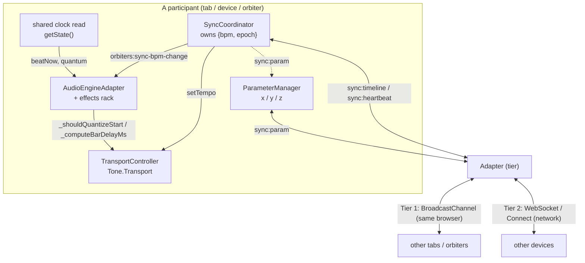

# Sync, Clock & Transport — How It Works

A guide to the system that keeps multiple players in time — across tabs, across devices, and
(the part we are extending) across multiple orbiters on one screen.

This is the **conceptual map**. For the file-by-file reference (APIs, gotchas, common mistakes)
see the skill `.agents/skills/ps-orbiters-sync-transport/SKILL.md`. For the bar-quantized-start
design notes see `docs/bar-quantized-start-and-transport.md`. This guide exists so we stop
re-inventing what is already built — when we add a feature, we plug into *this* model.

---

## The one idea: a participant

Everything in this system is organised around one concept: a **participant**. A participant is
anything that plays in time and can be kept in sync with others. Today a participant is:

- a **browser tab** on the same machine (Tier 1), or
- a **player on the network**, another device over the internet (Tier 2).

The thing we are building next — **several orbiters on one screen** — is just *more participants*,
living inside one tab. The whole point of this guide: that is not a new system. It is the same
model, extended inward. (See "The local multi-orbiter extension" at the end.)

Each participant already has an identity:

- Tier 1 (same browser): `tabId = 'tab-…'`, held in `BroadcastChannelAdapter.#peers`
- Tier 2 (network): `peerId = 'peer-…'`, held in `WebSocketSyncAdapter.#peers`

A participant joining the multi-orbiter view will carry a `voiceId` (already introduced on the
`voiceRegistry`). Same role, new tier.

---

## The four things every participant agrees on

### 1. The timeline — *what the tempo is*

The shared tempo is a tiny tuple: `{ bpm, epoch }`. From that, any participant computes the
current beat from *its own* clock — no need to stream the beat itself:

```js
currentBeat(now) = (now - epoch) / (60_000 / bpm)
```

Owned by **`SyncCoordinator`** (`src/sync/SyncCoordinator.js`). One entry point to change it:
`syncCoordinator.setTempo(bpm)`. That updates `Tone.Transport.bpm`, preserves phase, and
publishes to the other participants. Writing `Tone.Transport.bpm.value` directly desyncs everyone.
This is the Ableton-Link-equivalent model.

### 2. The clock — *where "now" comes from* (your option A: one neutral clock)

When participants need to *start together* on a bar line, they need a shared sense of "what beat is
it right now." That is the **neutral shared clock** — nobody is the master, everyone reads the same
source. It comes in two forms with **one identical interface**:

| Form | File | Source of "now" | Used for |
|------|------|-----------------|----------|
| Single-device | `src/sync/localClock.js` | `Date.now()` + a fixed epoch | tabs / orbiters on one machine |
| Network | `src/sync/sharedClock.js` (`BeatTimeline`) | server epoch + latency offset | players across the internet |

Both expose the same read seam:

```js
window.__orbitersSharedClock.getState()
// → { joined, beatNow, phaseNow, tempoBpm, quantum } | null
```

`null` until joined *with at least one other participant* — a solo player never quantizes. The
clock **never** writes `Tone.Transport`; tempo stays owned by `setTempo`. On one machine `Date.now()`
is already shared, so the local grid is identical across orbiters with zero coordination.

### 3. The conductor — *who proposes the tempo* (your option B: implemented)

When participants share tempo, one is the **conductor** — the first/oldest participant to join. It
proposes `{ bpm, epoch }`; the others follow. If a new participant joins, it defers to the existing
conductor. This is leaderless in the *clock* sense (everyone anchors to the same epoch) but has a
single tempo *proposer*. Election logic lives in both adapters (oldest `joinedAt` wins, ties broken
by id).

### 4. The switch — *shared or independent* (sync on / off)

One flag decides it: `syncCoordinator.isEnabled`.

- **on** → participants follow the shared clock and the conductor's tempo.
- **off** → each participant runs independently, at its own natural rate, no quantization.

Every gate in the audio path (`_shouldQuantizeStart`, wrap alignment, param mirroring) checks this
one flag. There is no second code path — on/off is a switch over the *same* path.

---

## Two channels — never mixed

A participant talks to the others over exactly two channels, and the split is enforced by
`SyncCoordinator`:

```
sync:timeline / sync:heartbeat  →  session BPM (bpm, epoch)  →  TransportController only
sync:param                      →  raw x/y/z axis values     →  ParameterManager only
```

Only `x` / `y` / `z` are mirrored, and only when that axis has a `tone.tempoPitch` effect
configured (checked via `audioEngine.getTempoManagedTargets()`). Everything else is local to the
participant. Param echoes are suppressed two ways (source-controller identity + a recent-values
boundary map) — do not add a third.

---

## The whole picture



Signal flow in words:

```
USER PRESSES PLAY
  → AudioEngineAdapter.play()
      → _shouldQuantizeStart()?  (reads shared clock + isEnabled + peerCount)
          yes → _computeBarDelayMs() from beatNow + quantum (launchGrid) → schedule start on next bar
          no  → start immediately
      → both participants read the SAME beatNow → they fall in on the same bar
      → _alignWrapPlaybackPosition leads the playhead by the per-device manual audio offset
        (computeAlignedSourcePositionMs outputLeadMs — device plays slightly AHEAD of the grid so its
         audio leaves the speaker earlier; per-device output-latency calibration, see the offset doc)

USER CHANGES TEMPO
  → syncCoordinator.setTempo(bpm)
      → Tone.Transport.bpm updated (phase preserved)
      → emits orbiters:sync-bpm-change   (local effects + WrapGridState react)
      → publishes sync:timeline           (other participants follow)
```

---

## The local multi-orbiter extension (the only real gap)

Everything above already works for tabs and for the network. What it does **not** yet handle is
**N orbiters inside one tab**, because three things are currently *one-per-tab*:

1. **`syncCoordinator`** is a module singleton — one tempo brain per tab.
2. **Effects and `WrapGridState`** listen on `window` for `orbiters:sync-bpm-change` /
   `orbiters:sync-status-change` — a global bus. With one orbiter per tab, `window` *is* that
   orbiter, so it works. With several in one tab, one orbiter's event would reach all of them.
3. **The shared-clock handle** lives on `window.__orbitersSharedClock` — one per window.

The fix is **not** a new event system. It is: make each on-screen orbiter a **participant**, the
same way a tab already is one — reusing the conductor, the neutral clock, and the on/off switch
unchanged. Concretely, the extension follows the participant model:

- Each orbiter is keyed by its `voiceId` (already on the `voiceRegistry` from A2/A3) — the same role
  `tabId` / `peerId` play for the existing tiers.
- The tempo brain becomes **per participant** (a `SyncCoordinator` per voice on the registry),
  instead of one window singleton. Sync **on** = the voices follow one neutral clock + conductor
  (exactly today's mechanism); sync **off** = each voice independent. The on/off switch and the
  clock do not change.
- An orbiter's effects listen to **its own** participant, not to `window`. The effect is built
  during that orbiter's boot, which already knows its `voiceId` — so the participant is handed in at
  build time rather than reached for globally.

Because tempo-sharing (your point: sync on → shared, sync off → independent) is already expressed
by the neutral clock + the `isEnabled` switch, the local multi-orbiter inherits it for free. We are
adding a tier of participant, not a second sync system.

> When this lands, update this section and the sync skill, and record the participant-per-voice
> decision in `decisions/` so the next change builds on it instead of re-deriving it.

---

## Where things live

| Concern | File |
|---------|------|
| Timeline owner, tempo entry point, echo suppression | `src/sync/SyncCoordinator.js` |
| Adapter tier selection (`?room=`) | `src/sync/init.js` |
| Tier 1 — same browser | `src/sync/adapters/BroadcastChannelAdapter.js` |
| Tier 2 — network (Connect) | `src/sync/adapters/WebSocketSyncAdapter.js` |
| Neutral clock — single device | `src/sync/localClock.js` |
| Neutral clock — network | `src/sync/sharedClock.js` |
| Launch-quantize grid (single owner) | `src/sync/launchGrid.js` |
| Transport wrapper (`Tone.Transport`) | `src/audio/transport/index.js` |
| Quantized start gates | `src/audio/AudioEngineAdapter.js` (`_shouldQuantizeStart` / `_computeBarDelayMs` / `_sharedClockBeat`) |
| Manual audio offset (per-device latency calibration) | `src/config/audioOffset.js` (value) + `WrapGridState.computeAlignedSourcePositionMs` `outputLeadMs` (applied) — see `bar-quantized-start-and-transport.md` §"Manual audio offset" |
| Beat-grid mirror for waveform | `src/audio/wrap/WrapGridState.js` |

---

## Rules that keep this clean

- **One tempo owner.** Only `syncCoordinator.setTempo` changes shared tempo.
- **The clock never writes tempo.** It only reports beats; `setTempo` owns `Tone.Transport`.
- **Two channels, never mixed.** Timeline → Transport, param → ParameterManager.
- **On/off is a switch, not a second path.** `isEnabled` gates the one path.
- **New players are new participants.** Reuse the participant model; don't stack a parallel system.
</content>
</invoke>
